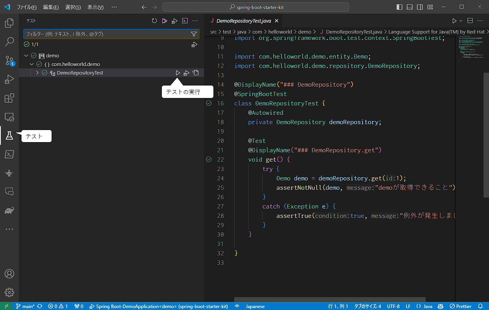

# Spring Boot Starter Kit
てっとり早くSpring Bootを学習したい人のための環境構築済みのプロジェクトです。  
以下のモジュールが含まれています。

以下の機能が学べます
- spring boot 
- 単体テスト(Java)
- テンプレートエンジン(thymeleaf)
- データベース(SQLiteを使用、サーバーレスのデータベースエンジン)
- TypeScript
- BootStrap
- node.js
- webpack
- もちろんHTML、CSS、JavaScriptも
- 他のフレームワークもgradleやpackage.jsonに追加すれば利用可能になるでしょう

## 目次

- [インストール](#install)
- [VSCode拡張機能](#vscode)
- [実行方法](#howtorun)
- [確認方法](#confirm)
- [単体テスト](#test)
- [ディレクトリ/ファイル構成について](#dir)
- [その他](#other)
  - TypeScriptの自動コンパイル
- [TODO](#todo)

## インストール 
以下のツールを各サイトからダウンロードしてインストールしてください。

- JDK17

    Javaの開発キットです。

    https://www.oracle.com/jp/java/technologies/downloads/  
    ※ JDK17、Windowsを選択
    ※ 環境変数の設定もやってくれるので、zip版よりexe/msi版の方が楽でしょう。

- VSCode(統合開発環境)

    VSCodeは、シンプルで使いやすいインターフェースと高いカスタマイズ性を備えた人気のあるソースコードエディタです。  
    開発者にとって効率的なコーディング環境を提供するため、幅広いプログラミング言語やプロジェクトの開発に利用されています。

    https://code.visualstudio.com/download

- npm

    JavaScriptベースのプロジェクトで使用されるパッケージ管理システムです。npmを使用することで、  
    他の開発者が共有しているJavaScriptライブラリやツールをプロジェクトに追加することができます。

    https://nodejs.org/en/download

    ※ 64bit版 Windows Installerを選択

- A5:SQL Mk-2
    A5:SQL Mk-2は複雑化するデータベース開発を支援するために開発されたフリーのSQLクライアントです。  
    SQLを実行したり、テーブルを編集するほかに、SQLの実行計画を取得したり、ER図を作成したりすることが出来ます。

    https://a5m2.mmatsubara.com/

## VSCode拡張機能 

プロジェクトをVSCodeで開くとおすすめ拡張機能のインストール確認があると思いますので、インストールしてください。  

- Spring Boot Extension Pack

    Spring Boot アプリケーションを開発するための拡張機能のコレクション。

    - Spring Boot Tools

        Spring Boot の「application.properties」、「application.yml」プロパティ ファイルの検証とコンテンツ支援を提供します。ブート固有の「.java」ファイルのサポートも同様です。

    - Spring Initializr Java Support

        クイックスタート Spring Boot Java プロジェクトを生成するための Spring Initializr に基づく軽量の拡張機能。

- Gradle for Java

    Gradle プロジェクトを管理し、Gradle タスクを実行します。

### 便利な拡張機能
- Comment Translate

    このプラグインは、Google Translate API を使用して、ソースに記述されているコメントを翻訳します。  
    フレームワークの機能を理解するのに役立ちます。

    ※ 設定 > 拡張機能 > Comment Translate > Target Language で "ja" を指定しておく(このプロジェクトでは設定済み)

- Google Translate

    Google Translate API を使用してコードを翻訳します。
    こちらは選択文字列をCtrl+Shift+Tで翻訳してくれます。  
    ※ 設定 > 拡張機能 > Google Translate > Google Translate Ext: Languages で "ja" を追加(このプロジェクトでは設定済み)

- ESLint

    ESLint はコードを静的に分析して問題を迅速に発見します。

- Prettier Formatter

    コードフォーマッタです。コードを解析し、行の最大長を考慮した独自のルールで再出力し、必要に応じてコードを折り返すことで、一貫したスタイルを強制します。

## 実行方法  

アクティビティバーから「Gradle」を選択してサイドバーを切り替えます。  
切り替えたらdemo > Tasks > application > bootRun から DebugTask を実行します。

## 確認方法  

ブラウザで http://localhost:8080/hello を開いて、「Hello World!」と表示されれば成功です。  
または、サイドバーから「実行でデバッグ」を選んで、Launch Chromeでも確認できます。

## 単体テスト 

アクティビティバーからテストを選択してサイドバーを切り替えます。    
切り替えたら、ツリー構成から任意のテストを実行できます。

## ディレクトリ/ファイル構成について 

| ディレクトリ                 | 説明                              |
|------------------------------|-----------------------------------|
| build                        | src配下のbuild結果を格納する場所  |
| src                          | ルート                            |
| src/main                     | 各種ソースの格納先                |
| src/main/java                | Javaソースコード                  |
| src/main/resources           | 様々なリソースを置く場所          |
| src/main/resources/static    | 静的コンテンツ  画像ファイル/CSS/JavaScriptなどはここに配置します。  |
| src/main/resources/templates | thymeleafのテンプレート           |
| src/ts                       | TypeScriptのソースコード BuildするとJavaScriptにコンパイルされ、staticディレクトリに配置されます。 |
| src/test                     | テストコードの格納先              |
| src/inex.js                  | webpackがまとめるファイル         |
| build.gradle                 | gradleのbuildスクリプト           |
| package.json                 | node.jsのプロジェクト設定ファイル |
| tsconfig.json                | TypeScriptの設定ファイル          |
| webpack.config.js            | webpackの定義ファイル             |

## その他 

### TypeScriptの自動コンパイル

自動コンパイルのタスクを実行すると、TypeScriptの修正の度にサーバーを再起動しなくて済むようになります。  
`Ctrl+Shift+P`でコマンドパレットを開き、`Tasks: Run Task`を選択して、`TypeScript Watch`を選択します。

### BootStrap ドキュメント

BootStrapのドキュメントは以下を参照してください。  
[getbootstrap](https://getbootstrap.jp/docs/5.3/getting-started/introduction/)

### Hot Reload について

すべてのフレームワークがHot Reloadに対応しているわけではありません。  
その場合、一度サーバーを停止して起動する必要があります(再起動より確実)

## TODO 

このあたりも対応したいですね。

- [ ] sass
- [ ] vue.js
- [ ] gulp
- [ ] TypeScriptの単体テスト
