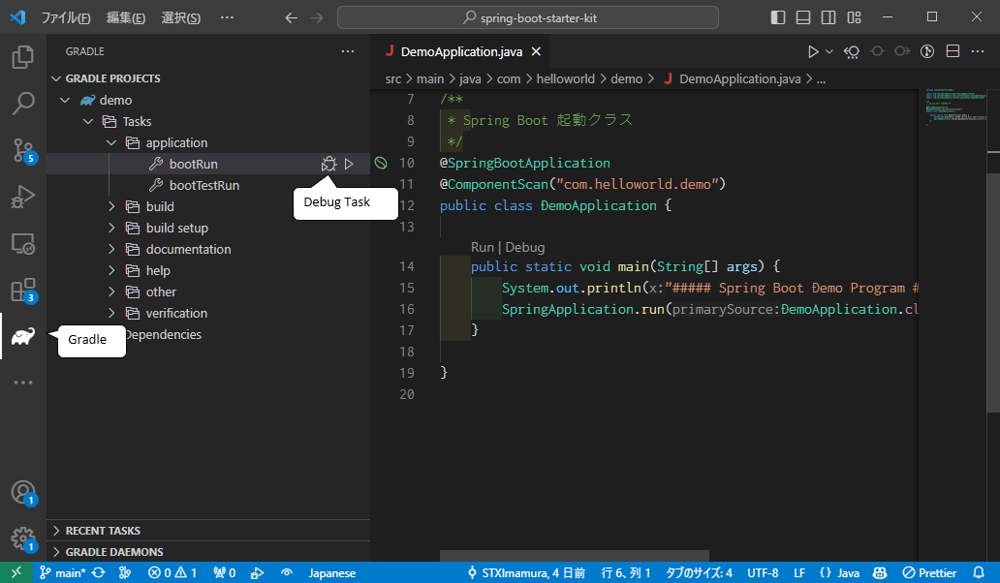

# Spring Boot Starter Kit
てっとり早くSpring Bootを学習したい人のための環境構築済みのプロジェクトです。  
以下のモジュールが含まれています。

以下の機能が学べます
- spring boot 
- データベース(SQLiteを使用、サーバーレスのデータベースエンジン)
- テンプレートエンジン(thymeleaf)
- 単体テスト
- もちろんHTML、CSS、JavaScriptも

## 目次

- [インストール](#install)
- [VSCode拡張機能](#vscode)
- [実行方法](#howtorun)
- [確認方法](#confirm)

## インストール 
以下のツールを各サイトからダウンロードしてインストールしてください。

- JDK17

    Javaの開発キットです。

    https://www.oracle.com/jp/java/technologies/downloads/  
    ※ JDK17、Windowsを選択
    ※ 環境変数の設定もやってくれるので、zip版よりexe/msi版の方が楽でしょう。

- VSCode(統合開発環境)

    VSCodeは、シンプルで使いやすいインターフェースと高いカスタマイズ性を備えた人気のあるソースコードエディタです。  
    開発者にとって効率的なコーディング環境を提供するため、幅広いプログラミング言語やプロジェクトの開発に利用されています。

    https://code.visualstudio.com/download

- A5:SQL Mk-2
    A5:SQL Mk-2は複雑化するデータベース開発を支援するために開発されたフリーのSQLクライアントです。  
    SQLを実行したり、テーブルを編集するほかに、SQLの実行計画を取得したり、ER図を作成したりすることが出来ます。

    https://a5m2.mmatsubara.com/

## VSCode拡張機能 

プロジェクトをVSCodeで開くとおすすめ拡張機能のインストール確認があると思いますので、インストールしてください。  

- Spring Boot Extension Pack

    Spring Boot アプリケーションを開発するための拡張機能のコレクション。

    - Spring Boot Tools

        Spring Boot の「application.properties」、「application.yml」プロパティ ファイルの検証とコンテンツ支援を提供します。ブート固有の「.java」ファイルのサポートも同様です。

    - Spring Initializr Java Support

        クイックスタート Spring Boot Java プロジェクトを生成するための Spring Initializr に基づく軽量の拡張機能。

- Gradle for Java

    Gradle プロジェクトを管理し、Gradle タスクを実行します。

### 便利な拡張機能
- Comment Translate

    このプラグインは、Google Translate API を使用して、ソースに記述されているコメントを翻訳します。  
    フレームワークの機能を理解するのに役立ちます。

    ※ 設定 > 拡張機能 > Comment Translate > Target Language で "ja" を指定しておく。

- Google Translate

    Google Translate API を使用してコードを翻訳します。
    こちらは選択文字列をCtrl+Shift+Tで翻訳してくれます。  
    ※ 設定 > 拡張機能 > Google Translate > Google Translate Ext: Languages で "ja" を追加。

## 実行方法  

アクティビティサイドバーのSpring Boot Dashboardを選択してサイドバーを切り替えます。  
切り替えたらAPPS > demo からDebugボタンで実行できます。

## 確認方法  

ブラウザで http://localhost:8080/hello を開いて、「Hello World!」と表示されれば成功です。

## 単体テスト

単体テストは、テストクラスを開いてチェックアイコンをクリックするか、右クリックから「テストを実行する」を選択して実行できます。

## その他

このプロジェクトはEclipseからも開けるようになっています。